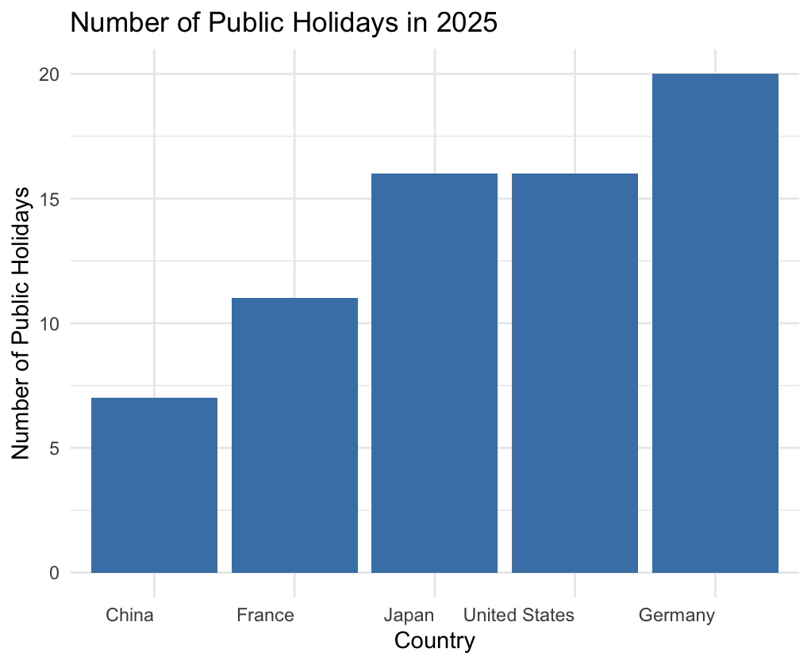

```{r setup, include = FALSE}
knitr::opts_chunk$set(
  collapse = TRUE,
  comment = "#>"
)
```

# publicholidays API Wrapper

### Getting Started

Installation of the package:

```{r}
library(remotes)
install_github("Raccoon-he/publicholidays")
```

Import library:

```{r}
library(publicholidays)
```

Import Extra libraries:

```{r}
library(httr)
library(jsonlite)
library(dplyr)
library(ggplot2)
```


### ph_available_countries()

To obtain the list of supported countries and their country code, call the ph_available_countries function.

This retrieves a list of all countries for which holiday data is available.

For quick analysis, simply call `ph_available_countries()`.

```{r}
ph_available_countries()
```

**Example Usage**

```{r}
countries <- ph_available_countries()
print(countries)
```


### ph_country_info()

To obtain the information of specific country, call the ph_country_info function.

This retrieves information of specific country, such as common name, official name, and region.

**Required Parameters**

| Parameter       | Description                                   | Default |
|-----------------|-----------------------------------------------|---------|
| `country_code`  | String specifying the country code.           | NULL    |

**Example Usage**

```{r}
# Get information about Germany
country_info <- ph_country_info("DE")
print(country_info)
```


### ph_is_today_holiday()

To check if today is a public holiday in specific country, call the ph_is_today_holiday  function.

**Required Parameters**

| Parameter       | Description                                   | Default |
|-----------------|-----------------------------------------------|---------|
| `country_code`  | String specifying the country code.           | NULL    |

**Example Usage**

```{r}
# Check if today is a public holiday in Germany
is_holiday <- ph_is_today_holiday("DE")
if (is_holiday) {
  print("Today is a public holiday in Germany!")
} else {
  print("Today is not a public holiday in Germany.")
}
```


### ph_long_weekends()

To obtain the list of long weekends in specific country, call the ph_long_weekends function.

This function retrieves a list of long weekends (extended weekends due to public holidays) for a specific country and year using the Nager.Date API.

**Required Parameters**

| Parameter       | Description                                   | Default |
|-----------------|-----------------------------------------------|---------|
| `country_code`  | String specifying the country code.           | NULL    |
| `year`          | String specifying the year.                   | NULL    |

**Example Usage**

```{r}
# Get long weekends for Germany in 2025
long_weekends <- ph_long_weekends("DE", 2025)
print(long_weekends)
```


### ph_public_holidays()

To obtain the list of public holidays in specific country, call the ph_public_holidays  function.

This function retrieves a list of public holidays for a specific country and year using the Nager.Date API.

**Required Parameters**

| Parameter       | Description                                   | Default |
|-----------------|-----------------------------------------------|---------|
| `country_code`  | String specifying the country code.           | NULL    |
| `year`          | String specifying the year.                   | NULL    |

**Example Usage**

```{r}
# Retrieve public holidays for Germany in 2025
holidays <- ph_public_holidays("DE", 2025)
print(holidays)
```


**Example of creating a bar plot showing the number of public holidays for each country**

```{r}
# Retrieve the list of supported countries
countries <- ph_available_countries()

# Select a few countries to analyze
selected_countries <- c("DE", "US", "CN", "JP", "FR")

# Initialize a data frame to store the results
holidays_count <- data.frame(
  country_code = character(),
  country_name = character(),
  num_holidays = integer(),
  stringsAsFactors = FALSE
)

# Loop through each selected country and retrieve public holidays
for (country_code in selected_countries) {
  country_name <- countries[countries$countryCode == country_code, "name"]
  holidays <- ph_public_holidays(country_code, 2025)
  num_holidays <- nrow(holidays)
  
  holidays_count <- rbind(holidays_count, data.frame(
    country_code = country_code,
    country_name = country_name,
    num_holidays = num_holidays
  ))
}

# Create a bar plot to visualize the number of public holidays
ggplot(holidays_count, aes(x = reorder(name, num_holidays), y = num_holidays)) +
  geom_bar(stat = "identity", fill = "steelblue") +
  theme_minimal() +
  labs(title = "Number of Public Holidays in 2025",
       x = "Country",
       y = "Number of Public Holidays") +
  theme(axis.text.x = element_text(hjust = 1))
```

**Example output of the plot**

::: {style="display: flex; justify-content: center;"}
{width="50%"}
:::
